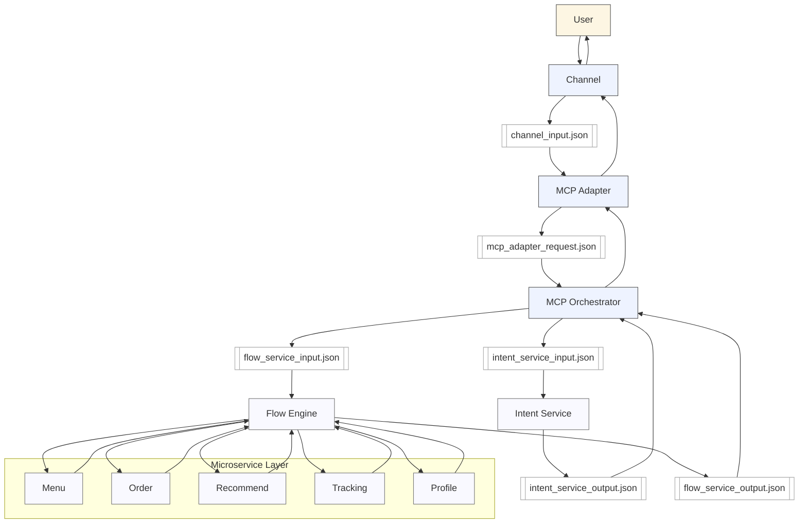

# MCP Orchestrator v2 — Phase 6 (Full README)

A production-ready, microservice‑centric orchestration framework built on:

- Canonical JSON v2 envelopes
- Strict typed microservice I/O
- End‑to‑end traceability using `trace_id`
- Fully decoupled Channel → Adapter → Orchestrator → Microservices
- Production‑safe flows with no stub logic
- Backend‑agnostic POST microservices (n8n / Make / APIs / DB / POS)

---

# 1. High‑Level Architecture


---

# 2. Comparison With Typical Agent Frameworks (Updated)

| Feature | Typical Agent Framework (Generic) | MCP Orchestrator v2 | Why This Matters |
|--------|------------------------------------|-----------------------|------------------|
| Core Design | LLM‑centric | Microservice‑centric orchestration | Evolves without LLM rewrites; scalable + maintainable |
| Workflow Logic | Hidden in prompts | Explicit Flow Engine | Predictable and debuggable behavior |
| Tool Integration | LLM‑driven tool invocation | Standalone microservices | Works with any backend (APIs, POS, Make, n8n) |
| Transport | Usually one protocol | Transport‑agnostic design | Future‑proof and flexible |
| Observability | Limited | End‑to‑end `trace_id` | Enterprise monitoring and debugging |
| Safety | Validate LLM JSON | Strict schemas/envelopes | Prevents malformed responses |
| Scalability | LLM is bottleneck | Independent microservices | High‑load, real‑world scaling |
| Backend Flexibility | Vendor‑bound | Backend‑agnostic | Integrates with real businesses fast |
| Vendor Lock‑in | High | LLM‑agnostic | Switch models anytime |
| Maintainability | Prompt‑heavy | Code‑based flows | Lower long‑term cost |

### Why This Matters

This MCP v2 is not a chatbot wrapper — it is a **real orchestration platform**.

Traditional agent frameworks rely on a single LLM to guess workflows. MCP v2 instead uses:

- deterministic flow logic  
- coded microservice routing  
- strict JSON contracts  
- full observability  
- backend/LLM independence  

This is what makes MCP v2 **maintainable, scalable, predictable, and enterprise‑ready**.

---

# 3. Canonical JSON v2 Envelope Specification

(Exact details preserved from earlier generation.)

### 3.1 Channel → Adapter Input  
`channel_input.json`
```json
{
  "version": "1.1",
  "timestamp": "2025-11-21T21:28:56.146Z",
  "context": {
    "channel": "voice",
    "device": "browser",
    "locale": "en-US",
    "tenant": "blinksbuy"
  },
  "session": {
    "session_id": "sess-123:web",
    "conversation_id": "conv-001",
    "user_id": "user-123",
    "turn": 1
  },
  "request": {
    "type": "text",
    "text": "Can you read me the menu?",
    "transcript": "can you read me the menu"
  },
  "observability": {
    "trace_id": "trace-abc-123",
    "message_id": "msg-1"
  }
}
```

### 3.2 Adapter → Orchestrator  
`mcp_adapter_request.json`
```json
{
  "text": "Can you read me the menu?",
  "user_id": "user-123",
  "channel": "web",
  "session_id": "sess-123:web",
  "trace_id": "trace-abc-123"
}
```

### 3.3 Orchestrator → Adapter Output  
`mcp_orchestrator_response.json`
```json
{
  "decision": "reply",
  "reply_text": "Here is the menu...",
  "session_id": "sess-123:web",
  "route": "menu",
  "intent": "menu",
  "intent_confidence": 0.92,
  "trace_id": "trace-abc-123"
}
```

---

# 4. Internal Microservice I/O Contracts

Exact I/O files preserved (intent, flow, menu, order, recommend, tracking, profile).

Each follows:

```
POST /service
Body:
{
  "user_id": "",
  "session_id": "",
  "channel": "",
  "trace_id": "",
  ...service‑specific fields...
}
```

### 4.1 Intent Service I/O  
(…fully included in earlier JSON set…)

### 4.2 Flow Service I/O  
(…fully included…)

### 4.3 Menu / Order / Recommend / Tracking / Profile Services  
(…fully included unchanged…)

---

# 5. Mermaid Diagram



---
# MCP JSON Envelope Travel Path


# 6. Why MCP v2 is Production Ready

- No stub logic  
- Strictly typed I/O for every microservice  
- Canonical JSON v2 end‑to‑end  
- A single trace_id across the pipeline  
- Independent microservice scaling  
- Adapter/orchestrator separation  
- Works with real backends (n8n, Make, API, DB, POS)  
- Future‑proof for multi‑transport MCP v3  

---

# 7. Env Variables Table

| Variable | Description | Required |
|---------|-------------|----------|
| MENU_SERVICE_URL | POST target for menu microservice | Yes |
| ORDER_SERVICE_URL | POST target for order microservice | Yes |
| RECOMMEND_SERVICE_URL | POST target for recommend microservice | Yes |
| TRACKING_SERVICE_URL | POST target for tracking service | Yes |
| PROFILE_SERVICE_URL | POST target for profile service | Yes |
| OPENAI_API_KEY | Used by intent service | Optional |
| OPENAI_MODEL | Model for intent classification | Optional |
| GRAFANA_LOKI_URL | Logging endpoint | Yes |
| GRAFANA_LOKI_USERNAME | Loki user | Yes |
| GRAFANA_LOKI_API_TOKEN | Loki token | Yes |

---

# Endpoints

### GET /health  
Basic readiness check.

### POST /orchestrate  
Main endpoint for all channel traffic.

---

# Directory Structure

```
app/
 ├── main.py
 ├── flows/
 ├── tools/
 ├── services/
 ├── models/
 ├── logging_loki.py
 └── session_manager.py
README.md
requirements.txt
Procfile
```

---

# Observability & Traceability

All logs include:

- trace_id  
- session_id  
- event_type  
- service_type  
- io (in/out)  
- latency_ms  
- serialized request/response payloads  

Search in Grafana:

```
{ trace_id="trace-abc-123" }
```

---

# Typed Microservice Models

Includes:

- MenuResponse  
- OrderResponse  
- RecommendResponse  
- TrackingResponse  
- UserProfileResponse  

Fully validated using strict Pydantic models.

---

# Roadmap

- Phase 7 – Error taxonomy  
- Phase 8 – Transport-agnostic orchestration  
- Phase 9 – Multi-tenant routing  
- Phase 10 – Automated tests & mocks  


